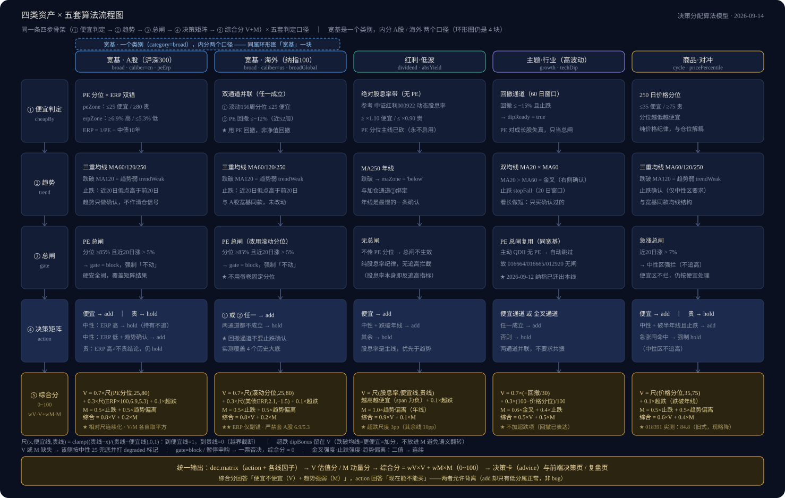

# Pharos

> 灯塔标示方位、提示暗礁，但它从不替你开船。

一个**跑在你自己电脑上**的基金投资看板。不预测涨跌、不替你决定金额，只把「现在贵不贵、能不能加」这件事用**可追溯的口径**算清楚。

- **全部数据在你本机** `data/` 目录里，不上传、不注册、不联网存储
- **零依赖**：只用 Node 内置模块，不需要 `npm install`
- **免费公开数据源**：天天基金 / 蛋卷 / 乐咕 / 新浪 / 东方财富，全都无需登录
- **手机可用**：与电脑同一 WiFi 打开局域网地址，可「加到主屏」当 PWA
- **深色界面**：深藏蓝 `#0A1020` + 鎏金 `#D9A441`，红涨绿跌（A 股习惯）

**在线介绍页**：<https://pharos-studio.github.io/pharos-open/>

---

## 3 步启动

1. 装 **Node.js 18 或更高**（LTS 版即可）：<https://nodejs.org/>
   > 必须 18+：本项目依赖全局 `fetch`。Node 16 能启动服务，但一调接口就会报 `fetch is not defined`。
2. **生成数据文件**
   - Windows：双击 **`setup.bat`**
   - macOS / Linux：**`npm run setup`**

   > 从 `data/example/` 的模板生成 3 个文件。**已存在则跳过，绝不会覆盖你的数据**，可以放心重复跑。
3. **启动服务**
   - Windows：双击 **`start.bat`**
   - macOS / Linux：**`npm start`**

   服务起来后浏览器打开 <http://localhost:3000>

改端口：`PORT=3001 npm start`（Windows cmd 写成 `set PORT=3001 && npm start`）。服务只监听本机，不对外暴露。

### 为什么第 2 步不能跳

看板启动时会**直接读取** `data/state/holdings.json` 和 `data/config/categories.json`，读不到就报错、页面打不开（而不是自动帮你建）。所以首次运行必须先把 3 个文件从模板生成出来（Windows 双击 `setup.bat`，其他平台 `npm run setup`）：

| 生成的文件 | 来源模板 |
| --- | --- |
| `data/state/holdings.json` | `data/example/holdings.example.json` |
| `data/config/config.json` | `data/example/config.example.json` |
| `data/config/categories.json` | `data/example/categories.example.json` |

### 首次运行会联网一次

会抓一份基金代码表（约 4MB）缓存到 `data/cache/`，之后不再需要。抓不到时基金搜索与名称解析会自动降级，不影响已有持仓的展示。

---

## 从 GitHub 拉到代码之后

```bash
git clone https://github.com/pharos-studio/pharos-open.git
cd pharos-open
npm run setup     # 生成数据文件（幂等，不覆盖已有数据）
npm start         # 打开 http://localhost:3000
```

**三平台命令完全一样，而且不需要 `npm install`** —— 本项目零运行时依赖，只用 Node 内置模块。Windows 也可以走上面那套 `.bat` 双击版，效果完全相同。

改完代码想确认没把算法弄坏：

```bash
npm test          # 生成数据文件 → 8 组离线校验 → 脱敏审计，全程不联网
```

| 命令 | 作用 |
| --- | --- |
| `npm run setup` | 从模板生成数据文件（已存在则跳过，不覆盖） |
| `npm start` | 启动本地服务（`PORT` 环境变量可改端口） |
| `npm test` | 全量自检：setup + 离线校验 + 脱敏审计 |
| `npm run test:offline` | 只跑 8 组离线校验（**需先 `npm run setup`**） |
| `npm run check:offline` | 证明那 8 组**真不联网**（给离线链加脚本前先跑它） |
| `npm run test:network` | 检查数据源连通性（**要联网**，所以不参与 CI） |
| `npm run audit` | 脱敏审计：确认仓库里没有私人路径、密钥、真实数值 |
| `npm run audit:nav` | 净值口径审计（只读报告，不参与门禁） |

> `test:offline` 里的校验以 `data/config/config.json` 的阈值为对照基准，所以**必须先 `npm run setup`**；懒得分步就直接 `npm test`，它会按顺序替你跑完。
>
> `test:network` 是唯一需要联网的校验（它要真的去请求东财与蛋卷接口）。**它不进 CI** —— 境外 runner 连不上国内数据源，会误报失败。怀疑净值/估值数据不对时，在本机手动跑它。

---

## 本仓库里有两个 `index.html`，别搞混

| 路径 | 是什么 | 谁提供 |
| --- | --- | --- |
| **根目录** `index.html` | **项目介绍页**（就是 GitHub Pages 上那一页） | 静态托管 / 直接用浏览器打开 |
| `public/index.html` | **应用本体外壳** | 由 `start.bat` / `npm start` 起的本地服务提供 |

后端**只托管 `public/`**，所以根目录那一页不会被本地服务接管 —— 这是有意的：一个给「还没装的人看」，一个给「已经在用的人用」。要看板请走 <http://localhost:3000>。

---

## 它和你手机里的基金 App 有什么不同

**1. 不读你的成本价。**
综合分只看市场信号，**不参考你的买入成本**。所以它不会因为你被套住就说「别卖」，也不会因为你浮盈就说「该跑」——判断不随你的仓位漂移。

**2. 只给信号，不给金额。**
看板告诉你「现在处于什么位置、要不要加」，**买多少、什么时候买，由你自己定**。引擎也从不清仓，只用新钱向目标配置慢慢靠拢。

**3. 不预测，只应对。**
它算的是「当前估值处在历史什么分位」「距高点回撤多深」「均线在什么位置」——都是**现在的事实**，不是对未来的预测。

**4. 每个结论都能追溯。**
决策卡会写清触发路径与具体数值；复盘页有**上周对比**；算法阈值来自真实历史回测，而不是拍脑袋。

---

## 功能（共 6 个页面）

- **概览** —— 总资产 / 今日盈亏 / 累计收益 / **累计投入**四张 KPI，近 N 日资产走势图与每月投入柱状图。
  > 口径说明：**累计投入 = 净投入**（扣掉申购费，与券商 App 的「持仓成本」同口径），它是「累计收益」的分母；卡片副行同时给出「实付（含申购费）」，两者差额即申购费。三者自洽：累计投入 − 累计收益 = 总资产（以绝对值计）。
- **决策** —— 每日信号：每只基金给出**判定徽章**（是否暂停申购 / 可加仓 / 不动）与**综合分 0~100**。综合分 = 估值分 V（便宜度）+ 动量分 M（趋势强度），徽章旁附「估X · 动Y」便于看清分数从哪来。
- **持仓** —— 基金列表（今日涨跌 / 持仓金额 / 累计收益 / 每日限购）；「记一笔买入」实时预览成交净值与份额（分 15:00 前 / 后两档）；买入记录可编辑、可删除；支持批量粘贴导入基金列表。
  > 在途份额会在净值公布后**自动补填**（QDII 走 T+2），无需手动。
  > 编辑口径：**改日期或时段会自动重算**净值/份额；只改金额或备注则不动数值，以保护你从券商抄来的真实值。
- **配置** —— 组合构成环形图（按算法四线：宽基 / 红利低波 / 科技成长 / 黄金对冲，显示**当前实际占比**）+ 穿透分析·科技赛道透视（旭日图 + 基金画像卡，并如实标注「披露覆盖 X%」）。
- **复盘** —— 决策链路回放：每只基金拆成「信号理由 / 原始数据 / 估值信号表（含**上周**列）/ 结论（含上周判定对比）」四段，可折叠细看。
- **设置** —— 后端连接（地址 + API Key）。手机访问时必须在这里填电脑的局域网地址。

四类资产用**五套不同口径**判定（宽基 A 股 / 宽基海外 / 红利 / 科技成长 / 黄金），因为「贵不贵」对不同资产要用不同的尺子：



引擎的整体链路：


---

## 数据来源与已知局限

- **净值 / 历史净值**：东方财富 `api.fund.eastmoney.com/f10/lsjz`（公开接口，无需登录）
- **无风险利率**（仅宽基的 ERP 第二锚）：东方财富 `RPTA_WEB_TREASURYYIELD`，同一请求同时返回中债 10 年与美债 10 年。**A 股口径只用中债、海外口径只用美债，两者不可互为兜底**（中美利差倒挂，混用会失真）
- **指数 PE 历史序列**（仅海外宽基）：蛋卷 `index_eva/pe_history/{code}?day=all`，约 10 年周频，用于自算滚动分位与 PE 回撤
- **指数 PE 当期分位**：蛋卷免登录接口（主源）→ 乐咕（A 股兜底）→ 本机常量兜底
- **前十大持仓**：东方财富 `fundf10.eastmoney.com`（季度披露，服务端缓存 1 天）
- **A 股盘中估算**：新浪指数实时；**QDII 基金没有盘中估值**，看板标注「海外休市」，以最新官方净值计

**局限（如实说明，不粉饰）**：

- 穿透分析基于季报的「前十大持仓」，**覆盖不到基金全部底层资产**，页面上以「披露覆盖 X%」标注；赛道图展示的只是已披露部分的内部分布
- 数据源是第三方公开接口，**可能变更或限流**。抓不到时看板会降级（显示缺失 / 用兜底值），不会伪造数据，也不会崩
- 历史快照 `data/state/history.json` 会随时间缓慢增长，个人规模下几十年也仅约 1MB

---

## 目录结构

```
backend/server.js       本地服务（静态托管 + 数据接口 + 快照）
backend/lib/store.js    数据访问层：唯一持有 DATA_DIR 与 data/ 分区映射表
backend/engines/        决策引擎（内核 + 四类策略）
backend/scripts/        离线校验与回测脚本
public/                 前端（原生 ES Module，零构建）
data/                   数据目录，按角色分五区
├── state/              运行状态（持仓 / 每日快照 / 决策记录 …）★ 唯一「丢了找不回」的目录，请定期备份
├── config/             配置（config.json 阈值、categories.json 类别、theme_map.json 赛道词典）
├── cache/              派生缓存，删了自动重建
├── series/             自建时序序列（增量累积）
└── example/            脱敏模板，setup.bat / npm run setup 从这里生成正式文件
docs/                   算法与架构文档
index.html              项目介绍页（GitHub Pages）
package.json            npm scripts：setup / start / test / audit
setup.bat               第一次运行：生成数据文件（Windows 双击；其他平台 npm run setup）
start.bat               启动服务（Windows 双击；其他平台 npm start）
```

> `data/state`、`data/series`、`data/config/config.json`、`data/config/categories.json` 与 `data/cache/` 都已写进 `.gitignore` —— **你的数据不会被提交**。

---

## 数据与隐私

- 持仓、买入记录、快照**全部只存在你本机**，本项目不含任何联网上传逻辑
- **写接口需要 API Key**：`/api/save`、`/api/purchase`、`/api/theme-map`、`/api/backfill-pending` 都以 `X-API-Key` 校验。服务端取口令的顺序是「环境变量 `FUND_API_KEY` → `data/config/config.json` 的 `apiKey`」，模板里预置为 `dev`
  - **没设** `FUND_API_KEY`（大多数情况）→ 设置页填 **`dev`** 即可，开箱能写
  - **设了** `FUND_API_KEY` → 填那个环境变量的值
  - 填错会**所有写操作 401**：页面能看、数据存不进去。前端只把 Key 存在浏览器 localStorage，**读数据不需要 Key**
- 密钥不要写进任何会被提交的文件；`.gitignore` 顶部有红线说明

---

## 常见问题

**页面打不开 / 报错？** 多半是第 2 步没做 —— 先生成数据文件（Windows 双击 `setup.bat`，macOS / Linux 跑 `npm run setup`）。

**能看到数据但存不进去？** 设置页的 API Key 填错了（默认应填 `dev`）。

**手机连不上？** 手机与电脑要在**同一个 WiFi**；`start.bat` / `npm start` 窗口里会打印局域网地址，用那个地址而不是 `localhost`。另外 Windows 防火墙可能拦首次入站连接，允许即可。

**在线 Demo 有吗？** 没有，也不会有 —— 这是纯本地应用，不提供云端服务。请 clone 到自己机器上跑。

---

## 许可与免责声明

以 **MIT 许可**开源，可自由使用、修改、分发（见 `LICENSE`）。

**本项目是技术工具，不构成任何投资建议。** 所有指标与结论都是基于公开历史数据的机械计算，不预测未来、不保证收益。投资决策与后果由使用者自行承担。数据来自第三方公开接口，其准确性、完整性与可用性不作保证。

**关于本仓库的角色**：`pharos-open` 是**共享代码的唯一真相源** —— 公共部分（`backend/`、`public/`、`data/example/`、公开文档）一律改在这里。维护者另有一份私有「数据机」仓库，只用它跑真实持仓数据、保存不公开的私人材料，它**不反过来覆盖本仓库**。
