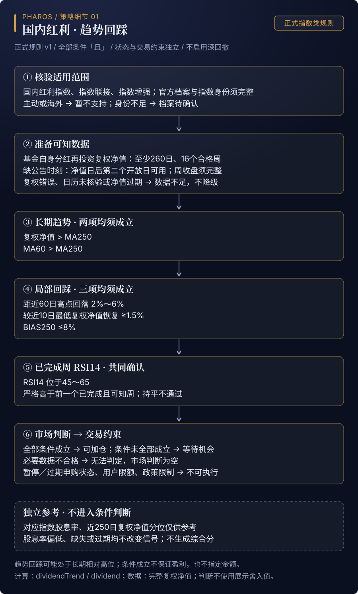
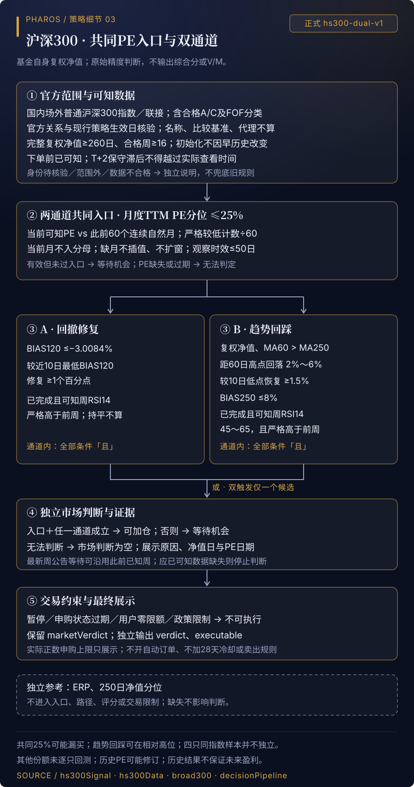
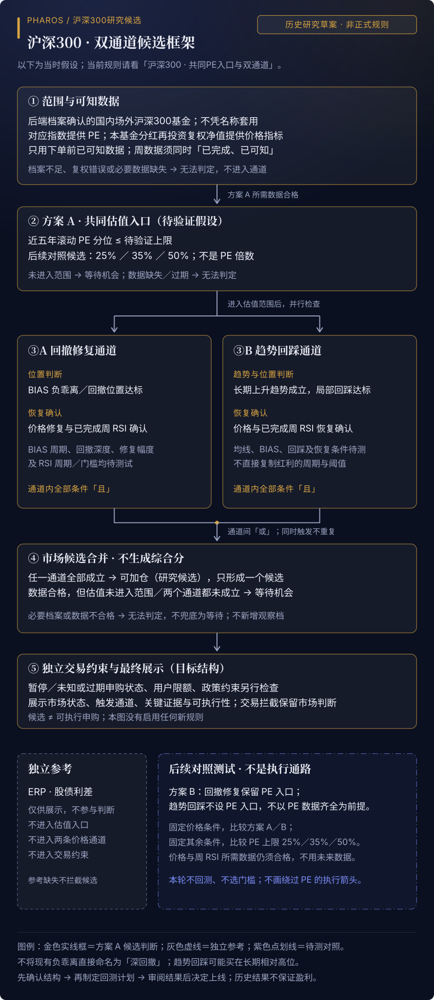
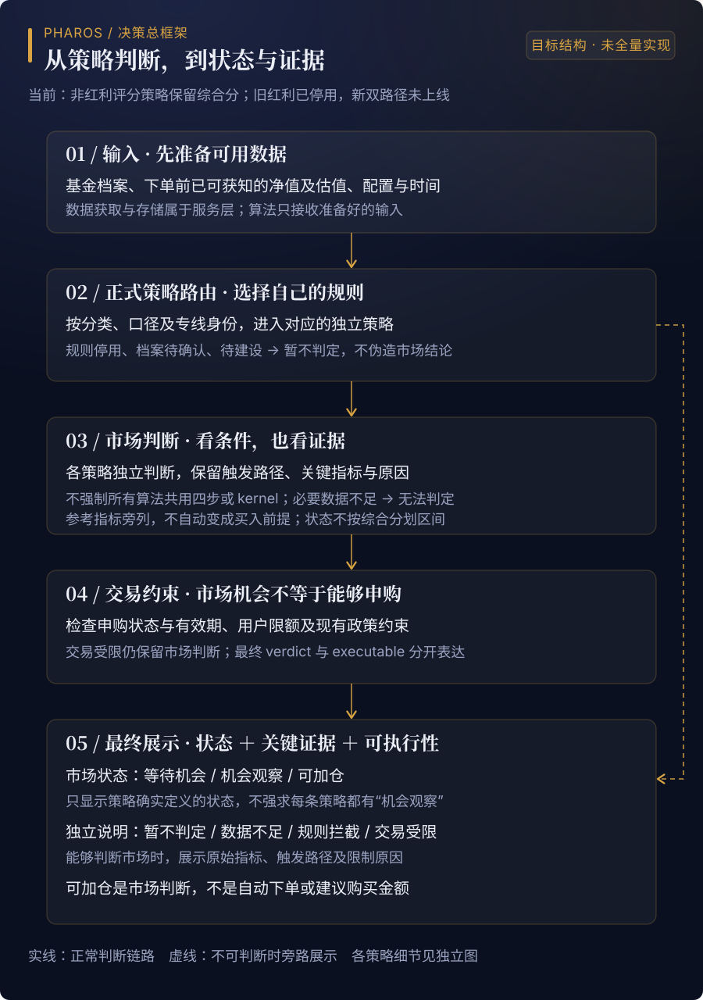
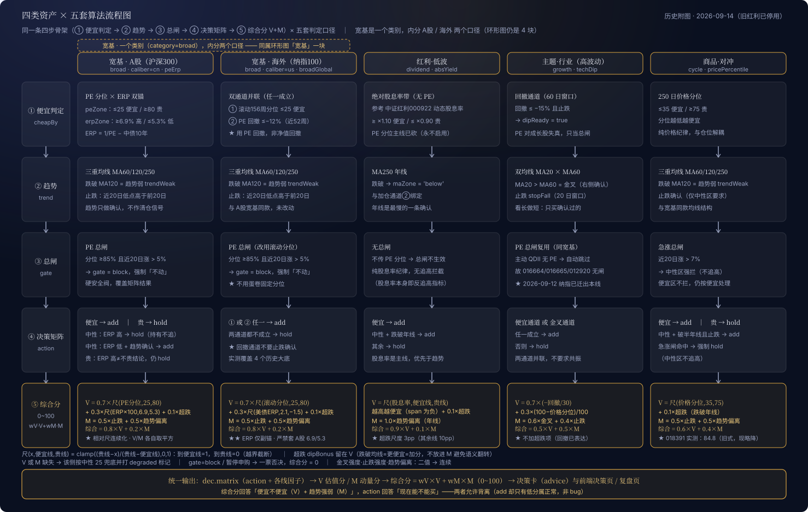

# Pharos

> 灯塔标示方位、提示暗礁，但它从不替你开船。

一个**跑在你自己电脑上**的基金投资看板。不预测涨跌、不替你决定金额，只把「现在贵不贵、能不能加」这件事用**可追溯的口径**算清楚。

国内黄金新增 `gold-dual-v1` 双路径工程候选：A 回撤修复／B 趋势回踩，基金自身复权净值和日 RSI14，不生成综合分。首批 000216、000217、000218、000307、002610、018391、018392 的官方身份快照已取得，但当前身份、日频采样、策略起点和基金日期尚未全部核验，实际可执行 **0／7**；启用门禁 `releaseEnabled=false`，页面明确「待启用」及缺失项。代码工程验收及独立审查已完成，仍须补齐真实资料并确认具体启用范围；发布或拉取代码不等于黄金已启用。复盘采用同份额复权的30个合格观察日、费用未计；真实证据不足保持待回填。白银、原油及其他商品保持原规则；[黄金独立流程图](docs/img/strategy-gold-flow.svg)。历史结果不保证盈利。

主动权益使用 `active-equity-buy-v1` 独立买入判断：基金自身复权净值的回撤修复／趋势回踩，任一路成立显示「可考虑买入」。016664、016665、012920 三个人民币 QDII 主动份额也进入这条路由，A/C 分别核验自身净值。QDII 使用基金专属的申购、估值日期和公告可知时点，缺证据显示「无法判定」及逐项缺口。当前九个登记份额均未通过日频采样门禁，可判定数量为 **0**（001714 官方身份仍待确认）。仅买入判断，不含卖出、补仓节奏或资金循环；[原国内规则图](docs/img/strategy-active-equity-flow.svg)及[当前范围说明](docs/决策分配算法模型.md#主动权益买入判断active-equity-buy-v1)。

决策页的基金卡片默认折叠，收起显示市场判断和独立交易限制，展开查看条件、指标、日期与核验缺口。此页面不显示综合分、估值分或动量分；评分接口及其他页面保留。

海外主动权益统一进入主动权益路由，沿用同一双路径参数；旧数据只有 QDII 与高波动类别时，先进入身份核验。未登记或证据不足的基金显示「档案待确认／无法判定」，不回落旧高波动评分。指数、联接、债券和货币基金仍按各自身份处理。

- **全部数据在你本机** `data/` 目录里，不上传、不注册、不联网存储
- **零依赖**：只用 Node 内置模块，不需要 `npm install`
- **免费公开数据源**：天天基金 / 蛋卷 / 乐咕 / 新浪 / 东方财富，全都无需登录
- **手机可用**：与电脑同一 WiFi 打开局域网地址，可「加到主屏」当 PWA
- **深色界面**：深藏蓝 `#0A1020` + 鎏金 `#D9A441`，红涨绿跌（A 股习惯）

**在线介绍页**：<https://pharos-studio.github.io/pharos-open/>

---

## 3 步启动

1. 装 **Node.js 18 或更高**（LTS 版即可）：<https://nodejs.org/>
   > 必须 18+：本项目依赖全局 `fetch`。Node 16 能启动服务，但一调接口就会报 `fetch is not defined`。
2. **生成数据文件**
   - Windows：双击 **`setup.bat`**
   - macOS / Linux：**`npm run setup`**

   > 从 `data/example/` 的模板生成 3 个文件。**已存在则跳过，绝不会覆盖你的数据**，可以放心重复跑。
3. **启动服务**
   - Windows：双击 **`start.bat`**
   - macOS / Linux：**`npm start`**

   服务起来后浏览器打开 <http://localhost:3000>

改端口：`PORT=3001 npm start`（Windows cmd 写成 `set PORT=3001 && npm start`）。

服务默认监听**所有网卡**（手机同 WiFi 访问靠的就是它），启动时会把可用的局域网地址打印出来。只想本机访问就设 `HOST=127.0.0.1`（Windows cmd 写成 `set HOST=127.0.0.1 && npm start`）。

### 为什么第 2 步不能跳

看板启动时会**直接读取** `data/state/holdings.json` 和 `data/config/categories.json`，读不到就报错、页面打不开（而不是自动帮你建）。所以首次运行必须先把 3 个文件从模板生成出来（Windows 双击 `setup.bat`，其他平台 `npm run setup`）：

| 生成的文件 | 来源模板 |
| --- | --- |
| `data/state/holdings.json` | `data/example/holdings.example.json` |
| `data/config/config.json` | `data/example/config.example.json` |
| `data/config/categories.json` | `data/example/categories.example.json` |

### 首次运行会联网一次

会抓一份基金代码表（约 4MB）缓存到 `data/cache/`，之后不再需要。抓不到时基金搜索与名称解析会自动降级，不影响已有持仓的展示。

### 第一次打开：加你的第一只基金

首次运行拿到的是**空看板**（不含任何示例持仓），页面会提示你去「我的基金」加第一只。加基金先填**代码**：

1. 「我的基金」(`#/holdings`) → 快速添加基金 → 填 6 位**基金代码**
2. **名称、类型、市场、基础分类、口径、官方跟踪指数和盘中估算指数**由后端识别；分类只能启发式判断时需选定基础类别，使用代理指数时需明确确认
3. 添加后展开基金记录买入；自动档案只读，纠错可用「重新识别自动档案」预览差异并确认替换

有两种情况**不会给买卖结论**——看板会明说，而不是给一个看着正常的错答案：

| 情况 | 页面表现 |
| --- | --- |
| 类别是「债券」或「现金」 | 标**待建设**：照常计入总资产与配置占比，但不参与买卖判定 |
| 拿不到跟踪指数（缺估值锚） | 标**缺估值锚·降级**：改用价格分位，理由里写明降级原因 |

> 基金只使用系统基础分类。旧自定义分类会映射到原绑定的基础分类，并保留迁移审计；无法映射的基金需重新识别确认分类。

### 纳指100专线

正式接入在工程验收通过后本地启用；数据不合格仍无法判定。`nasdaq-dual-v1` 仅用于官方核验的人民币场外纳指100普通指数或联接份额。回撤修复与趋势回踩任一完整成立，显示市场「可加仓」；两路均未成立才「等待」，含未知且无成立路径则「无法判定」。不输出综合分，趋势不要求PE，ERP仅参考。完整条件见[算法说明](docs/决策分配算法模型.md#41c-纳指100专线nasdaq-dual-v1)。

身份、连续历史、基金估值与开放规则分别核验，不因名称或研究样本代码自动准入。未核份额、缺应有净值或规则市场集合不明会明确无法判定，不退回旧PE规则。当前运行日历覆盖2010—2026年；2027年尚未覆盖，超出覆盖范围保持「无法判定」，须核验更新后再使用。首次完整历史刷新按份额分页，可能较慢。

实际已取得快照只证明本次已知，不证明历史当时已知；PE历史可能修订，RSI严格微小回升保留原始精度。暂停、过期状态、每日零限额、配置政策独立拦截；跨15:00或休市的未来申请日期仅提示届时复核，不保证成交。新复盘独立版本，不重标旧事件。

---

## 从 GitHub 拉到代码之后

```bash
git clone https://github.com/pharos-studio/pharos-open.git
cd pharos-open
npm run setup     # 生成数据文件（幂等，不覆盖已有数据）
npm start         # 打开 http://localhost:3000
```

**三平台命令完全一样，而且不需要 `npm install`** —— 本项目零运行时依赖，只用 Node 内置模块。Windows 也可以走上面那套 `.bat` 双击版，效果完全相同。

改完代码想确认没把算法弄坏，请在全新临时副本中运行以下检查，只使用空模板或合成数据。检查会执行 setup 并可能写测试数据，不要在真实记账目录运行：

```bash
npm test          # 生成数据文件 → 离线校验 → 脱敏审计，全程不联网
```

| 命令 | 作用 |
| --- | --- |
| `npm run setup` | 从模板生成数据文件（已存在则跳过，不覆盖） |
| `npm start` | 启动本地服务（`PORT` 环境变量可改端口） |
| `npm test` | 全量自检：setup + 离线校验 + 脱敏审计 |
| `npm run test:offline` | 当前 34 个离线校验脚本，以 `package.json` 清单为准（**需先 `npm run setup`**） |
| `npm run check:offline` | 用程序级网络守卫检查 `test:offline` 清单（给离线链加脚本前先跑它） |
| `npm run test:network` | 检查数据源连通性（**要联网**，所以不参与 CI） |
| `npm run audit` | 脱敏审计：确认仓库里没有私人路径、密钥、真实数值 |
| `npm run audit:nav` | 净值口径审计（只读报告，不参与门禁） |

> 在上述临时副本里，`test:offline` 的校验以 `data/config/config.json` 的阈值为对照基准，所以**必须先 `npm run setup`**；`npm test` 会依次执行 setup、离线校验和审计。
>
> `test:network` 是唯一需要联网的校验（它要真的去请求东财与蛋卷接口）。**它不进 CI** —— 境外 runner 连不上国内数据源，会误报失败。怀疑净值/估值数据不对时，在本机手动跑它。

---

## 升级须知

已经在用的用户，升级前先停止本地服务，在项目目录之外独立保存**同一次的完整 `data/` 副本及代码备份**。记录当前代码版本；有未提交代码时也备份其文件。完整数据包括 state、config、series、cache 及已有迁移文件，不能只备份 holdings.json。核对备份可读取后再拉取代码：

```bash
git pull
```

`git pull` 更新代码，不会覆盖被忽略的本地持仓、历史与个人配置；`data/example/`、`data/config/theme_map.json` 等公开文件仍随代码更新。**拉代码与首次重启是两个步骤**：重启会触发下列已有的 v1→v2 迁移，并可能联网取资料。

- 旧 holdings 没有 `_schemaVersion` 或仍为 v1 时，程序先自动备份 holdings/history，再按每只基金迁移时取得的当前申购费率重算全部旧买入份额，并重建原有快照日期的金额与收益。成交净值沿用记录中的净值，历史快照还需历史净值；份额、净投入与收益展示可能变化。已正常完成 v2 的账户不会再次执行这次全量重算。
- 迁移费率口径是当前记录费率（缺失时尝试抓取渠道折后费率），**不是逐笔历史实付费用的核证**。v1 迁移会将旧份额改为 `formula-v2` 并清除旧抵扣标记；即使曾保存券商份额，也不能用 v2 日常编辑的 broker 保护来推断 v1 迁移会保留它。没有 broker 标签也不证明旧份额不是券商或用户真值。保存券商对账依据，先在独立脱敏副本核对差异；真值、费率或历史资料不足时先补齐，不能宣称无损升级。
- 费率、成交净值或所需历史净值缺失时，迁移不替换源 holdings/history，保持只读并显示缺失项；只读不代表整个 `data/` 零写入，启动仍可能生成备份、缓存或补齐类别配置。不要手改 `_schemaVersion`、清空历史或删数据来绕过迁移。资料核对后可在页面重试。
- 自动 `*.bak-*` 和 journal 用于两文件迁移事务的恢复，**不能代替项目外完整备份**。回滚前再次停服务并另存升级后的完整数据，保留期间新增买入和记录；然后成对恢复升级前的相容代码与同一次完整 `data/` 备份，核对后再启动。只退代码、只还原一个文件或手改版本号都不是完整回滚。

代码发布保留黄金关闭门禁和主动权益真实资料门禁，不会让缺资料的基金变成可执行。每次更新内容见 [CHANGELOG.md](CHANGELOG.md)。

---

## 本仓库里有两个 `index.html`，别搞混

| 路径 | 是什么 | 谁提供 |
| --- | --- | --- |
| **根目录** `index.html` | **项目介绍页**（就是 GitHub Pages 上那一页） | 静态托管 / 直接用浏览器打开 |
| `public/index.html` | **应用本体外壳** | 由 `start.bat` / `npm start` 起的本地服务提供 |

后端**只托管 `public/`**，所以根目录那一页不会被本地服务接管 —— 这是有意的：一个给「还没装的人看」，一个给「已经在用的人用」。要看板请走 <http://localhost:3000>。

> 介绍页的样式与脚本已拆到 **`landing/`** 下（`base.css` / `blocks.css` / `deck.css` / `landing.js` / `hero-3d.js`），根 `index.html` 只保留 13 页骨架与几行引用。两套前端依旧互不相干：介绍页是静态托管，`public/` 由本地服务提供。

---

## 它和你手机里的基金 App 有什么不同

**1. 不读你的成本价。**
综合分只看市场信号，**不参考你的买入成本**。所以它不会因为你被套住就说「别卖」，也不会因为你浮盈就说「该跑」——判断不随你的仓位漂移。

**2. 只给信号，不给金额。**
看板告诉你「现在处于什么位置、要不要加」，**买多少、什么时候买，由你自己定**。引擎也从不清仓，只用新钱向目标配置慢慢靠拢。

**3. 不预测，只应对。**
它算的是「当前估值处在历史什么分位」「距高点回撤多深」「均线在什么位置」——都是**现在的事实**，不是对未来的预测。

**4. 每个结论都能追溯。**
决策卡会写清触发路径与具体数值，复盘页有**上周对比**。规则研究使用历史资料和带有明确假设的模型，使用时仍须核对适用范围、数据门禁与局限；模型结果不等于真实成交，历史表现不保证未来收益。

---

## 功能（共 6 个页面）

- **概览** —— 总资产 / 今日盈亏 / 累计收益 / **累计投入**四张 KPI，近 N 日资产走势图与每月投入柱状图。
  > 口径说明：**累计投入 = 净投入**（扣掉申购费，与券商 App 的「持仓成本」同口径），它是「累计收益」的分母；卡片副行同时给出「实付（含申购费）」，两者差额即申购费。三者自洽：累计投入 − 累计收益 = 总资产（以绝对值计）。
- **决策** —— 每日信号：每只基金给出**判定徽章**（是否暂停申购 / 可加仓 / 不动）；普通策略还显示**综合分 0~100**（估值分 V + 动量分 M）。沪深300专线改用市场状态与关键指标，不使用综合分。
- **我的基金**（路由仍为 `#/holdings`）—— 快速添加、自动档案、申购状态、用户每日上限、持仓与买入记录统一管理；新买入可按全局默认或逐笔选择积分抵扣。
  > 在途份额会在净值公布后**自动补填**（QDII 走 T+2），无需手动。
  > 份额公式：`金额 ÷ (1 + 有效费率) ÷ 成交净值`，保留 4 位。正常 v2 请求由服务端计算，显式券商真值优先保留；v1 首次迁移另有全量重算行为，见「升级须知」。
  > v1→v2 按当前率重建旧份额与已有历史日期；任一所需费率或净值缺失时不替换源 holdings/history，进入只读模式。先做独立完整备份并核对真值，再升级或重试。
- **配置** —— 组合构成环形图（按系统基础分类显示**当前实际占比**）+ 穿透分析·科技赛道透视（旭日图 + 基金画像卡，并如实标注「披露覆盖 X%」）。
- **复盘** —— 决策链路回放：每只基金拆成「信号理由 / 原始数据 / 估值信号表（含**上周**列）/ 结论（含上周判定对比）」四段，可折叠细看。
- **设置** —— 后端连接（地址 + API Key）。手机访问时必须在这里填电脑的局域网地址。

现行策略按资产类别与口径分流；普通 A 股宽基、海外宽基、主题·行业和商品·对冲规则保持不变，确认跟踪沪深300的 A 股宽基另走已接入的专线。国内红利指数类已接入趋势回踩规则；股息率仅参考，不使用综合分。

### 独立策略流程图

每套策略单独读图，不再把不同判断挤在同一张对照表中。正式图按当前规则说明，实际阈值以代码和配置为准；候选图只表达待验证结构，其中数字不代表已上线参数。各图统一项目 G0 风格；借用骨架表达，不强制策略执行相同顺序。`kernel` 仅保留兼容转发。

| 策略 | 独立图与运行状态 |
|---|---|
| 红利低波 | [趋势回踩正式规则图](./docs/img/strategy-dividend-flow.svg) |
| 普通 A 股宽基 | [PE × ERP 图（当前运行，不含沪深300专线）](./docs/img/strategy-broad-cn-flow.svg) |
| 沪深300专线 | [共同PE入口与双通道（正式规则，不使用综合分）](./docs/img/strategy-hs300-flow.svg) |
| 沪深300历史研究图 | [双通道候选草案（存档，不作为运行规则）](./docs/img/strategy-hs300-candidate-flow.svg) |
| 海外宽基 | [双通道估值图（当前运行）](./docs/img/strategy-broad-global-flow.svg) |
| 主题行业 | [回撤或均线恢复图（当前运行）](./docs/img/strategy-tech-flow.svg) |
| 商品对冲 | [价格分位与止跌图（当前运行）](./docs/img/strategy-commodity-flow.svg) |

红利图展示国内指数、指数联接及指数增强基金的趋势回踩：长期趋势、局部回落、恢复幅度、BIAS250和已完成周RSI全部达标才形成「可加仓」。主动及海外红利暂不支持。股息率与250日净值分位只作参考，不影响信号；暂停、过期申购状态及用户约束仍可拦截执行。趋势回踩可能处于长期相对高位，历史结果不保证盈利。沪深300使用下述冻结双通道；其他策略不变。手机可点击独立图放大查看。



### 沪深300双通道怎样使用

版本 `hs300-dual-v1` 只接入官方关系与现行策略生效日核验合格的国内场外普通指数、联接份额（含合格A/C及FOF法律分类）。增强、主动、海外及其他指数不支持；仅有名称、比较基准或代理锚不能启用。当前四只已核验样本为202015、000051、160706、110020；其他份额还须取得官方证据，无法核验显示「档案待确认」，不是自动照搬样本。

- 共同入口：已可知月度TTM PE，相对此前60个连续自然月严格较低的值计数÷60，分位≤25%；当前月不入分母，缺月不插值，PE超过50日不可判定。
- 回撤修复：BIAS120≤−3.0084%、近10日乖离修复≥1个百分点、已完成且可知周RSI14严格回升，全部成立。
- 趋势回踩：复权净值与MA60高于MA250、60日回落2%～6%、10日恢复≥1.5%、BIAS250≤8%、周RSI14在45～65且严格回升，全部成立。

两通道取「或」，同时成立只形成一个市场候选；不设28天限购或新增卖出规则。到「决策」看市场状态、信号净值日、申请日、PE日期及路径；「复盘」展开逐项条件。申购/用户/政策限制决定可执行性，不能覆盖市场结果。数据不可判定时保持空判断，不用「等待机会」冒充正常运行。

指标使用本份额完整分红再投资复权净值，初始化从核验策略生效日与2013-01-01较晚者开始。无历史公告时刻时按核验交易日T+2可用，同时不能越过实际查看时点；15:00后显示下一开放日期依据，市场开市不保证基金可申购。净值超过14日、缺日历或复权核验失败时不可执行；公告等待可沿用此前已知完整周。ERP及250日净值分位只参考，历史PE可能修订。四只同指数样本不是四份独立证据，也不保证其他份额或未来买点盈利。



原候选图保留设计过程中的A/B与门槛对照，属于历史研究草案，不作为运行参数；正式实现仅采用共同25%入口及上述冻结价格条件。



[放大查看候选图](./docs/img/strategy-hs300-candidate-flow.svg)。候选图图例：金色实线框为方案 A 候选判断，灰色虚线框为独立参考，紫色点划线框为待测对照说明；其余正式图的实线表示现行判断链路，虚线框表示独立参考。

### 决策总图：状态输出目标结构



[放大决策总图](./docs/img/decision-flow.svg)。末端目标为市场状态、关键证据与可执行性，不按综合分分段；本轮只改图文，非红利评分策略当前仍保留综合分，沪深300专线继续显示现有状态。

后端按职责组织：`strategies` 独立判定，`decisionPipeline` 编排，`scoring` 评分，`tradeConstraints` 交易约束，`services` 处理配置归一和历史数据读取。分析与建议复用同一次结果；旧入口保留兼容，但不再承载策略规则。详见[后端架构](./docs/后端架构清单.md)。

<details>
<summary>历史附图：原五套算法对照</summary>

历史对照图只统一外观，保留原规则内容，含已停用的旧红利规则、旧标签及阈值，未覆盖沪深300专线。它不是当前运行说明；当前策略以上方独立图和代码为准。



[放大历史对照图](./docs/img/four-engines-flow.svg)。

</details>

公开下载包含正式算法、使用说明和小型合成功能测试，不包含研究代码、历史收益模拟、研究快照或实验报告。本地研究另行保留，正式运行与测试均不依赖它。

---

## 数据来源与已知局限

- **净值 / 历史净值**：东方财富 `api.fund.eastmoney.com/f10/lsjz`（公开接口，无需登录）
- **无风险利率**（仅宽基的 ERP 第二锚）：东方财富 `RPTA_WEB_TREASURYYIELD`，同一请求同时返回中债 10 年与美债 10 年。**A 股口径只用中债、海外口径只用美债，两者不可互为兜底**（中美利差倒挂，混用会失真）
- **指数 PE 历史序列**（仅海外宽基）：蛋卷 `index_eva/pe_history/{code}?day=all`，约 10 年周频，用于自算滚动分位与 PE 回撤
- **指数 PE 当期分位**：蛋卷免登录接口（主源）→ 乐咕（A 股兜底）→ 本机常量兜底
- **前十大持仓**：东方财富 `fundf10.eastmoney.com`（季度披露，服务端缓存 1 天）
- **A 股盘中估算**：官方跟踪指数的行情验证成功后自动启用（东方财富）；黄金等代理指数需确认（新浪）。行情过期或不可用时不显示近似值；**QDII 基金不启用现有盘中估算模型**
- **基金费率**（申购费 / 认购费 / 赎回费档位 / 管理费·托管费·销售服务费）：东方财富移动接口 `FundMNRateInfo`
  - ★ 申购费抓的是**销售渠道给的折后价**（这里是天天基金的 1 折），**不等于你在别的渠道实付的数** —— 银行常按原价收，券商与支付宝各不同。看板同时存了法定原价，鼠标悬停在「申购费」上可见
  - 运作费（管理 / 托管 / 销售服务费）**已从每日净值中扣除**，本看板只存档、不重算（重算就是重复扣）；赎回档位（如「持有 7 天内 1.5%，7 天后 0%」）目前也只存档、不参与计算

**局限（如实说明，不粉饰）**：

- 穿透分析基于季报的「前十大持仓」，**覆盖不到基金全部底层资产**，页面上以「披露覆盖 X%」标注；赛道图展示的只是已披露部分的内部分布
- 数据源是第三方公开接口，**可能变更或限流**。抓不到时看板会降级（显示缺失 / 用兜底值），不会伪造数据，也不会崩
- 历史快照 `data/state/history.json` 会随时间缓慢增长，个人规模下几十年也仅约 1MB

---

## 目录结构

```
backend/server.js       本地服务（静态托管 + 数据接口 + 快照）
backend/lib/store.js    数据访问层：唯一持有 DATA_DIR 与 data/ 分区映射表
backend/engines/        正式策略、决策编排、交易约束与兼容入口
backend/services/       正式数据服务（红利完整净值等）
backend/scripts/        公开离线校验、审计与维护脚本（不含研究回测）
public/                 前端（原生 ES Module，零构建）
data/                   数据目录，按角色分五区
├── state/              持仓 / 每日快照 / 决策记录 …，不能靠 setup 重建；请定期完整备份 data/
├── config/             配置（config.json 阈值、categories.json 类别、theme_map.json 赛道词典）
├── cache/              派生缓存，删了自动重建
├── series/             自建时序序列（增量累积）
└── example/            脱敏模板，setup.bat / npm run setup 从这里生成正式文件
docs/                   算法与架构文档
index.html              项目介绍页（GitHub Pages）—— 13 页骨架 + 对 landing/ 的引用
landing/                介绍页的样式与脚本（base / blocks / deck.css + landing.js + hero-3d.js）
package.json            npm scripts：setup / start / test / audit
setup.bat               第一次运行：生成数据文件（Windows 双击；其他平台 npm run setup）
start.bat               启动服务（Windows 双击；其他平台 npm start）
```

> `data/state`、`data/series`、`data/config/config.json`、`data/config/categories.json` 与 `data/cache/` 都已写进 `.gitignore` —— **你的数据不会被提交**。

---

## 数据与隐私

- 持仓、买入记录、快照**全部只存在你本机**，本项目不含任何联网上传逻辑
- **写接口需要 API Key**：`/api/save`、`/api/purchase`、`/api/theme-map`、`/api/backfill-pending` 都以 `X-API-Key` 校验。服务端取口令的顺序是「环境变量 `FUND_API_KEY` → `data/config/config.json` 的 `apiKey`」，模板里预置为 `dev`
  - **没设** `FUND_API_KEY`（大多数情况）→ 设置页填 **`dev`** 即可，开箱能写
  - **设了** `FUND_API_KEY` → 填那个环境变量的值
  - 填错会**所有写操作 401**：页面能看、数据存不进去。前端只把 Key 存在浏览器 localStorage，**读数据不需要 Key**
- 密钥不要写进任何会被提交的文件；`.gitignore` 顶部有红线说明

---

## 常见问题

**页面打不开 / 报错？** 多半是第 2 步没做 —— 先生成数据文件（Windows 双击 `setup.bat`，macOS / Linux 跑 `npm run setup`）。

**能看到数据但存不进去？** 设置页的 API Key 填错了（默认应填 `dev`）。

**手机连不上？** 手机与电脑要在**同一个 WiFi**；`start.bat` / `npm start` 窗口里会打印局域网地址，用那个地址而不是 `localhost`。另外 Windows 防火墙可能拦首次入站连接，允许即可。

**在线 Demo 有吗？** 没有，也不会有 —— 这是纯本地应用，不提供云端服务。请 clone 到自己机器上跑。

---

## 许可与免责声明

以 **MIT 许可**开源，可自由使用、修改、分发（见 `LICENSE`）。

**本项目是技术工具，不构成任何投资建议。** 所有指标与结论都是基于公开历史数据的机械计算，不预测未来、不保证收益。投资决策与后果由使用者自行承担。数据来自第三方公开接口，其准确性、完整性与可用性不作保证。

**关于本仓库的角色**：`pharos-open` 是**共享代码的唯一真相源** —— 公共部分（`backend/`、`public/`、`data/example/`、公开文档）一律改在这里。

维护者另有一份私有「数据机」仓库，只用来跑真实持仓数据、存放不公开的私人材料，两仓之间靠一份显式清单同步。⚠️ 对维护者的提醒：清单内的文件方向是**双向**的 —— 若漏掉「把本仓库同步回数据机」这一步就直接从数据机发布，本仓库里这些文件会被数据机上的旧版本覆盖，而且**不会报错**（`CONTRIBUTING.md` 第 6 节讲了完整顺序）。

作为贡献者你不需要关心这套机制：**公共代码改在本仓库、走 PR 就行。**

---

## 参与贡献

欢迎 issue 与 PR。动手前请读 [`CONTRIBUTING.md`](CONTRIBUTING.md)，里面有四条会直接影响 PR 能否合并的硬规矩：

- **`npm test` 必须全绿** —— 它会顺带跑**脱敏审计**：仓库里出现真实私人数据、本机路径、密钥，一律 FAIL
- **`docs/` 下的 `.md` 走白名单**，不是想加就能加（放错一个文件等于放行一份私人笔记）
- **同一个口径只允许一份实现** —— 改算法前先看那 5 个「唯一真相源」是哪几个
- **同一个文件不要两边各改一半**，要改就整份一次改完

安全相关问题请不要开公开 issue，见 [`SECURITY.md`](SECURITY.md)。

---
