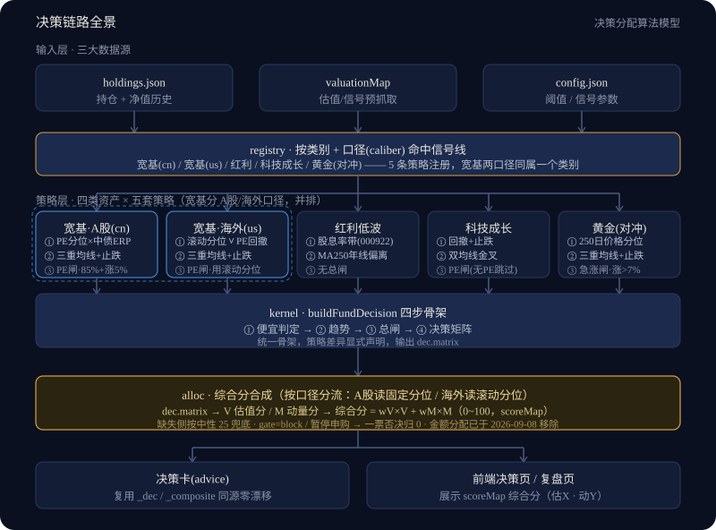

# 决策分配算法模型

> 版本：2026-09-08（2026-09-12 增补「宽基·海外」口径） · 对应代码：`backend/engines/alloc/allocation.js` + `backend/engines/kernel.js` + `backend/engines/strategies/*` + `backend/engines/registry.js`
> 本文档是决策链路的**算法说明书**：讲清每只基金"何时该买、该给多少综合分"，以及背后的设计理由。

---

## 0. 先说结论（TL;DR）

- 系统**不预测顶底**，只做一件事：**客观衡量"现在便宜不便宜"**。
- 四类资产各用一套最适合它的估值口径，而不是一套 PE 打天下：
  - **宽基** → PE 分位 × 股债利差(ERP) 双锚；**宽基内部再分口径**（`caliber`）：`cn` A股（乐咕PE × 中债ERP）/ `us` 海外（自算滚动分位 ∨ PE回撤，见 §4.1b）；
  - **红利低波** → 绝对股息率带（相对红利指数动态参考）；
  - **科技成长** → 回撤 + 止跌 + 双均线金叉（PE 对成长股失真，只做总闸不做主线）；
  - **黄金(对冲)** → 250 日价格分位 + 三重均线位置。
- 四套口径共享同一个**四步决策骨架**（便宜判定 → 趋势 → 总闸 → 决策矩阵），差异只在"便宜怎么判"和"趋势看什么"。
- 决策结果被连续化为 **0~100 的「综合分」**（2026-09-14 由「位置分」重构而来）：**综合分 = wV×估值分V + wM×动量分M** —— **V** 属均值回归派（PE分位/ERP/股息率/价格分位/回撤），**M** 属动量派（金叉强度/止跌强度/趋势偏离，**已由二值改连续**）。分越高越值得买。**金额由用户自定**（引擎不自动分配金额，见文末「演进记录」）。
- **综合分 ≠ 决策**：综合分回答「值多少」（连续），`action` 回答「现在能不能买」（二值，含趋势通道），**二者允许背离** —— 如同「考了多少分」与「及没及格」本就该分开看（见 §5.4）。
- **`category` ≠ 算法口径**（2026-09-12 明确）：`category` 只有 4 个值（决定环形图分块与配置桶），**口径由新增的 `caliber` 字段承载**。同一个 `category=broad` 下，A股走 `caliber=cn`、海外走 `caliber=us`，两套阈值完全独立、严禁互换。

---

## 1. 决策链路总览

```
                   ┌──────────────────────────────────────────────┐
                   │                 输入层(三大数据源)              │
                   │  holdings.json(持仓+净值历史)  valuationMap   │
                   │  (估值/信号预抓取)  config.json(阈值参数)        │
                   └──────────────────────────────────────────────┘
                                        │
                                        ▼
                   ┌──────────────────────────────────────────────┐
                   │   registry · 按基金类别命中信号线               │
                   │   宽基 / 红利低波 / 科技成长 / 黄金(对冲) 四线注册 │
                   └──────────────────────────────────────────────┘
                                        │
              ┌───────────────┬─────────┴──────────┬──────────────┐
              ▼               ▼                    ▼              ▼
      ┌─────────────┐ ┌─────────────┐   ┌──────────────┐ ┌─────────────┐
      │  宽基策略    │ │ 红利低波策略  │   │ 科技成长策略   │ │ 黄金(对冲)   │
      │ PE×ERP 双锚 │ │ 股息率带     │   │ 回撤+止跌+金叉 │ │ 价格分位     │
      └─────────────┘ └─────────────┘   └──────────────┘ └─────────────┘
              └───────────────┬─────────┴──────────┬──────────────┘
                                        ▼
                   ┌──────────────────────────────────────────────┐
                   │   kernel.buildFundDecision 四步骨架           │
                   │   ①便宜判定 → ②趋势 → ③总闸 → ④决策矩阵      │
                   │   统一骨架，策略差异显式声明，输出 dec.matrix   │
                   └──────────────────────────────────────────────┘
                                        │
                                        ▼
                   ┌──────────────────────────────────────────────┐
                   │   alloc · 综合分合成(scoreMap 0~100)          │
                   │   dec.matrix → 连续化综合分 · 同源零漂移        │
                   └──────────────────────────────────────────────┘
                                        │
              ┌─────────────────────────┴────────────────────────┐
              ▼                                                  ▼
      ┌─────────────────┐                              ┌─────────────────┐
      │ 决策卡(advice)   │                              │ 前端决策页/复盘页 │
      │ L2已确认/未确认  │                              │ 展示综合分       │
      └─────────────────┘                              └─────────────────┘
```



> **读图前先分清两层**：`registry` 的 4 条是**判定信号线**（口径不同：宽基 vs 红利低波 走完全不同的估值方法）；而组合管理上这 4 线归并为 **3 个配置桶**——核心(宽基+红利低波) / 成长(科技) / 对冲(黄金)。信号线决定"这只基金怎么判"，配置桶决定"它算哪类仓位"。一只基金按其 `category` 只命中其中 1 条信号线。
>
> **再分清第三层：`caliber`（口径，2026-09-12 新增）**。`category` 回答"它是哪一类资产"，`caliber` 回答"这一类里用哪把尺子量"。目前只有 `broad` 需要分口径：`cn`（A股：乐咕 PE 分位 × 中债10年 ERP）与 `us`（海外：自算滚动分位 ∨ PE 回撤，外加美债 ERP 仅作综合分副锚）。**`caliber` 缺省 = `cn`**，旧数据不带该字段也能正常工作；环形图与配置桶只看 `category`，所以加口径**不会**改变组合构成的分块。
>
> **"L2"是什么**：文中 `L2 已确认/未确认` 指内核四步骨架输出的 `action` 结论（`add`=已确认加仓 / `hold`=未确认不动）。"L2"是历史沿用的分层叫法（决策层），不是二次确认流程，读到 `dec.action` 即它本身。

---

## 2. 双重估值思想（本模型的理论根基）

不同资产的"贵/便宜"不能用同一把尺子量：

| 资产类型 | 为什么不用 PE 分位做主线 | 用什么 |
|---|---|---|
| 宽基指数 | PE 分位在宽基上有效（成分稳定、盈利周期平滑） | PE 分位(纵向比历史) × ERP(横向比债券) |
| 红利低波 | 盈利稳定、股息率本身就是"估值"；且标的指数无免费 PE 历史 | 绝对股息率带(相对动态参考) |
| 科技成长 | 盈利波动大、PE 分位失真（戴维斯双杀/双击），会误判"便宜" | 回撤 + 止跌 + 趋势(金叉)——用价格行为代替估值 |
| 黄金(对冲) | 黄金无盈利，PE 无意义 | 250 日价格分位 + 三重均线位置 |

> 一句话：**有价值锚的看锚（PE/股息率/ERP），没有可靠价值锚的看价格行为（回撤/分位/均线）**。这就是"双重估值"：价值/防御类用分位估值，科技/成长类用回撤+止损确认。

---

## 3. 内核四步骨架：buildFundDecision

四类策略共享一个骨架，按 `cheapBy` 切换信号源。骨架固定四步：

### ① 便宜判定（cheapBy 分支）
| 模式 | 对应资产 | 便宜判据 |
|---|---|---|
| `peErp` | 宽基 | 锚1：PE 分位 ≤25% 便宜 / ≥80% 贵；锚2：ERP=1/PE−无风险利率，≥**6.9%** 高 / ≤**5.3%** 低（近5年 p90/p10，2026-09-09 重标定） |
| `absYield` | 红利低波 | 基金股息率 ≥ 便宜线(动态参考×1.10) 便宜 / ≤ 贵线(×0.90) 贵 |
| `techDip` | 科技成长 | 60日回撤 ≤ −15% **且** 已止跌（近20日低点 > 前20日低点） |
| `pricePercentile` | 黄金(对冲) | 250日价格分位 ≤35% 便宜 / ≥75% 贵 |

### ② 趋势
| 模式 | 趋势信号 |
|---|---|
| `peErp` / `pricePercentile` | 三重均线位置（MA60/120/250）；跌破半年线(MA120)=趋势弱 |
| `absYield` | MA250 年线偏离（±3% 带：below/above/near） |
| `techDip` | 双均线金叉状态（MA20 > MA60 = golden） |

### ③ 总闸（硬性安全阀，命中强制"不动"）
- **PE 总闸**（宽基/科技走 PE 分位时生效）：PE 分位 ≥85% 且近20日涨 >5% → 强制不动。
- **急涨总闸**（黄金模式）：近20日涨 >7% → 仅中性区强拦（便宜区不拦）。

### ④ 决策矩阵（action: add / hold）
各模式"买入通道"逻辑见 §4。内核输出标准化决策对象 `dec`，**顶层结构与 matrix 分离**：

```
dec = {
  action:  'add' | 'hold',          // 决策结论（L2 判定）
  reasons: [ '人类可读触发路径', ... ],
  matrix:  {                        // 判定明细（综合分合成只读它）
    gate, yieldZone, maZone, devPct, ratio, dipReady,
    drawdown, stopFall, goldenState, cross, pctZone,
    peZone, erpZone, trendWeak, trendGrade,
    pricePercentile, recent20dChange, surge
  }
}
```

`matrix` 字段含义：
- `gate`: `pass`/`block`（总闸）；`yieldZone`: `cheap/neutral/expensive/na`（红利）；
- `peZone`/`erpZone`: 宽基双锚区；`pctZone`: 黄金分位区；`maZone`: 趋势带（`golden/dead`、`below/above/near`）；
- `drawdown`/`stopFall`: 回撤深度与止跌；`goldenState`/`cross`: 金叉状态与事件；`trendWeak`/`trendGrade`: 趋势强弱；
- `pricePercentile`/`recent20dChange`/`surge`: 分位、近20日涨幅与急涨标志；`devPct`/`ratio`: 年线偏离%与股息率比值。

---

## 4. 四类资产 × 四套判定细则

> 下面四小节是逐条文字规则；同类信息的一图速览见 [`img/four-engines-flow.svg`](./img/four-engines-flow.svg)（四类算法流程图：① 便宜判定 → ② 趋势 → ③ 总闸 → ④ 决策矩阵 → ⑤ 综合分，横向可比同一步的口径差异）。

### 4.1 宽基（core / broad）— PE 分位 × ERP 双锚

| 环节 | 规则 |
|---|---|
| 便宜 | PE 分位 ≤25% 便宜（乐咕近5年滚动）；≥80% 贵 |
| 第二确认 | ERP = 1/PE − 中债10年（≥**6.9%** 高=股票划算 / ≤**5.3%** 低=债券划算；2026-09-09 按近5年 p90/p10 重标定，旧 4.5/2.5 已失效） |
| 趋势 | 三重均线 MA60/120/250，跌破 MA120 = trendWeak |
| 总闸 | PE 分位 ≥85% 且近20日涨 >5% → block |
| 加仓 | PE 便宜 → 加（ERP 低时理由标"谨慎"）；PE 中性 + ERP 低 + 跌破 MA120 + 止跌 → 谨慎加 |
| 不动 | PE 贵（ERP 高=非真贵 / ERP 低=真贵均 hold）；PE 中性无确认信号 → hold |

双锚交叉成四象限：PE 分位回答"纵向比自己历史贵不贵"，ERP 回答"横向比债券划不划算"。

### 4.1b 宽基·海外（`category=broad` + `caliber=us`）— 滚动分位 ∨ PE 回撤

> 适用标的：纳指100 等**海外被动宽基指数**（当前 016452 / 018966，`trackIndex=NDX`）。
> 与 §4.1 的关系：**同属 `broad` 大类**（环形图仍是一块、配置桶仍是"核心"），但**判定算法与阈值完全独立**，因为下面这条诊断结论。

**为什么不沿用 §4.1 的 A 股双锚**（2026-09-12 基于真实历史数据诊断）：

| 问题 | 实测证据 |
|---|---|
| ① **固定 PE 分位会「锈住」** | 纳指 PE 逐年抬台阶：2016-2019 中位 **27.4** → 2023-2026 中位 **35.1**（+30%）。A 股那套固定全样本分位下，便宜线钉在 PE 25 不动，而水位涨上去了 → **2024/2025/2026 连续三年零触发**，规则名存实亡 |
| ② **中债 ERP 对美股是错配** | 纳指 PE≈30 时盈利收益率仅 3.3%，低于中债（1.69%）→ 已失真；对美债（4.96%）更是**结构性为负**。临界点 PE=14.3，纳指十年没低于 20 → `erpZone` 恒为 `low` |
| ③ **A 股 ERP 阈值直接套用会把副锚压死** | `relScale(−1.64, 6.9, 5.3)` 恒 clamp 成 0 → 位置分**硬顶 49 分**，纳指再便宜也拿不到"可重仓"（≥64）。**静默失败**，不报错 |

**判定规则（两通道并联，任一成立即加仓）**：

| 环节 | 规则 |
|---|---|
| 便宜①（估值通道） | PE 在**滚动 156 周（3年）**窗口内分位 ≤25% → 便宜（`isCheap`） |
| 便宜②（回撤通道） | **PE** 距近 **52 周**高点回撤 ≤ **−12%** → 便宜（★2026-09-13 复验后由 15% 放宽）。★**不要求止跌** |
| 趋势 | 三重均线 MA60/120/250，跌破 MA120 = trendWeak（同 §4.1） |
| 总闸 | PE **滚动**分位 ≥85% 且近20日涨 >5% → block（★传 `gatePercentile`=滚动分位，非蛋卷固定分位） |
| 加仓 | ① 或 ② 任一成立 → `add` |
| 综合分副锚 | ERP = 1/PE − **美债10年**，带 `[−1.5, 2.1]`；**仅影响分数与展示，不参与 add/hold** |

**为什么"滚动分位"而不是蛋卷给的现成分位**：蛋卷 `pe_percentile` 是**固定约 10 年**口径（实测与我方全样本分位吻合），正好带着问题①的缺陷。故滚动分位**由本项目自算**：`util.rollingPercentile(valuation.peHistory, 156)`，数据来自 `fetchIndexPeHistory('NDX')`（蛋卷 `?day=all`，约 10 年周频）。

**为什么回撤用 PE 而不是净值**（数据打脸直觉，两条都实测过）：

纳指 60 天跌 15% 极罕见（那个门槛是给高波动科技基金设的），所以**净值回撤几乎不触发**。另外**回撤通道不加"止跌"确认**（`peDipRequireStop=false`）——PE 回撤是"估值先压缩"，等价格止跌时反弹已走一截。

| 通道 | 2026-09-13 复验（`backtest_broad_global_us.js`，270042 主序列 14 年） |
|---|---|
| 净值回撤 | 在纳指几乎不触发（2023 起仅 2 次） |
| **PE 回撤**（阈值 **12%**） | 事件 40、R6m **+8.9%**、ΔR6m **+1.69pp**、7 个关键底部覆盖 **5/7**、2024 触发 **20 天** |

> ★ **2026-09-13 复验更新**：阈值由 **15% 放宽至 12%**（C1 组 8/8 判据全过）。
> **双向证据链**：放宽新增 11 信号 R6m **+17.1%**（> 现状的 +7.2%）；收紧到 20% 时被筛掉 9 信号 R6m **+10.5%**（也 > 现状）
> → 两个方向同时指向"15% 偏紧"。
> ⚠ 本段此前所引"PE 回撤 24 次 / 超额 +16.7%"与"加止跌降到 +5.9%"**无脚本支撑、且与文档其他处（"29 次"）互相矛盾**，已作废。

**窗口选择（三个窗口都实测过）**：近 1 年"喊得勤但喊不准"（36 次信号、超额仅 +8.6%、最差一次 2024-09 之后 6 个月只涨 3.9%）；近 5 年质量高但迟钝（2025 全年只触发 2 周）；**取近 3 年**（17 次、超额 +25.5%、最差一次仍有 +36.6%）。

> ⚠ 上段的 36 次 / +8.6% / +25.5% / +36.6% **未经复验**（2026-09-13 复验只做了窗口稳健性：104 周 / 260 周相对现状的 ΔR6m 分别为 +1.27pp / +0.27pp，均在 ±2pp 内），保留原文待后续核对。

**并联覆盖度验证**（这是选它的核心理由）：只有"滚动3年分位 ∨ PE回撤"覆盖了全部四个历史关键买点——

| 买点 | 滚动3年分位 | PE回撤 | 并联 |
|---|---|---|---|
| 2018-12 / 2020-03 | ✓ | ✓ | ✓ |
| 2022-12 | ✓ | ✗ | ✓ |
| **2025-04** | ✗ | **✓** | ✓ |

**阈值标定**（`erpHigh=2.1` / `erpLow=−1.5`，与 A 股同一套 p10/p90 方法学）：

- 数据：纳指 PE 周频 513 点（2016-09 ~ 2026-09）× 美债10年日频 3750 点（2011-09 起），按日期对齐后 513 个 ERP 点；
- 全期 10 年 ERP 分布：**p10=−1.54 / p50=+0.81 / p90=+2.11**（近5年 p90 只有 +1.29，近3年 p90 甚至为 **−1.08** → 整条带子全负，"便宜"永远触发不到，是饱和陷阱）；
- **必须用全期 10 年**：中位数在窗口间翻转（10年 +0.81 → 近5年 −1.27 → 近3年 −1.45）不是噪声，是美债从 0.5% 涨到 5% 的**利率体制切换**；只有全期跨完整周期、体制中性；
- ★**严禁套用 A 股的 6.9/5.3**：美股 ERP 结构性为负（实测当前 −1.64%），套用会让副锚永久饱和在 0 → 综合分硬顶 49 分；
- 重标定：`node backend/scripts/calibrate_broad_global.js`（联网只读，会打印建议值与当前 config 的偏离度）。

**数据源**（两腿都不需要新源）：

| 腿 | 来源 | 兜底 |
|---|---|---|
| 美债10年 | 东财 `RPTA_WEB_TREASURYYIELD` 的 `EMG00001310` 列（**与中债同请求不同列**），`fetchBond10Y()` | `config.usTreasury10y` 常量。★**绝不可回退中债** |
| 纳指 PE 历史 | 蛋卷 `index_eva/pe_history/NDX?day=all`，`fetchIndexPeHistory()` | 无 → 回撤通道停用，综合分走 25 分兜底 |

**已知副作用**：纳指移出 `growth` 后，「科技赛道透视」旭日图不再包含 NVDA/AAPL/MSFT 等暴露（该图定位是"**主动**科技暴露"，宽基计入反而污染口径，故不加开关）。

### 4.2 红利低波（dividend）— 绝对股息率带

| 环节 | 规则 |
|---|---|
| 便宜 | 基金股息率 ≥ 参考线×1.10 → cheap（相对中证红利 000922 动态股息率参考带） |
| 贵 | 股息率 ≤ 参考线×0.90 → expensive |
| 趋势 | MA250 年线偏离（>3% above / <−3% below / 中间 near） |
| 总闸 | PE 总闸**关闭**（不传 PE 分位，红利纯走股息率带，不受 PE 约束） |
| 加仓 | 股息率 cheap → 加（股息率是主线，优先）；中性 + 跌破年线 → 加（趋势确认） |
| 不动 | 股息率 expensive → hold 防高位接盘；中性且未破年线 → hold |

> 红线（用户 2026-09-01 拍板）：红利**永不启用 PE 分位主线**（标的指数无免费 PE 历史、代理指数不接近）。股息率带是动态的：参考线跟随 000922 实时股息率移动，不设死数；仅在动态参考缺失时回退固定带（便宜线 4.5% / 贵线 3.5%）。

### 4.3 科技成长（growth / tech）— 回撤 + 止跌 + 金叉

| 环节 | 规则 |
|---|---|
| 便宜 | 60日窗口回撤 ≤ −15% 且止跌（近20日低点 > 前20日低点，下跌动能衰竭） |
| 趋势 | 双均线 MA20/MA60：MA20>MA60 = golden（上升路线） |
| 总闸 | PE 分位 ≥85% 且近20日涨 >5% → block（主动 QDII 无 PE 自动跳过） |
| 加仓 | 两条通道任一满足：① 深度回撤+止跌；② 均线金叉趋势修复 |
| 不动 | 回撤未到位且无金叉；回撤已深但未止跌（等止跌确认）|

> 设计理由：成长股盈利波动大，PE 分位会失真。改用**价格行为**：大跌后的"止跌"是下跌动能衰竭的证据，金叉是趋势修复的证据——只买"确认过"的，不赌底不追高。

### 4.4 黄金/对冲（cycle / gold）— 价格分位 + 三重均线

| 环节 | 规则 |
|---|---|
| 便宜 | 250日价格分位 ≤35% 便宜 / ≥75% 贵 / 中间中性 |
| 趋势 | 三重均线 MA60/120/250，跌破 MA120 = 趋势弱 |
| 总闸 | 近20日涨 >7% → 仅中性区强拦（便宜区不拦） |
| 加仓 | 分位 cheap → 加；中性 + 跌破半年线 + 已止跌 → 加（机会区） |
| 不动 | 分位 expensive → hold 防高位接盘；中性急涨强拦；中性无确认 → hold |

---

## 5. 综合分合成（scoreMap 0~100）

决策矩阵是离散的（add/hold），只看"能不能买"太粗 → 由 `alloc/allocation.js` 把 `dec.matrix` 合成为 **0~100 综合分**（对外入口 `synthesizePositionScore`，函数名为历史兼容保留），回答"值不值得买、值多大的位置"。

> **2026-09-14：评分层拆为两派** —— **V 估值分**（均值回归派）+ **M 动量分**（动量派），`综合分 = wV×V + wM×M`。
> 旧「位置分」是单一估值核 + **二值**动量补丁（金叉 `+0.1` / 未止跌 `×0.3`），看不出动量强弱、也说不清两派各贡献多少；
> 本次把动量因子**全部由二值改连续**（金叉强度 / 止跌强度 / 趋势偏离）。★ 决策层 `add/hold` **一行未改**，两层继续分开显示。

### 5.1 三层结构

| 层 | 实现 | 视角 | 取值 |
|---|---|---|---|
| **V 估值分** | `synthesizeValueScore(dec, AC, cheapBy, caliber)` | 均值回归派：越便宜越高 | 0~100 |
| **M 动量分** | `synthesizeMomentumScore` | 动量派：趋势越强越高 | 0~100 |
| **综合分** | `synthesizeCompositeScore` → `wV×V + wM×M` | 两派加权 + 硬约束 | 0~100 |

**统一归一化函数（相对尺）**：

```
relScale(x, cheap, expensive) = clamp((expensive − x) / (expensive − cheap), 0, 1)
```

- 到 **cheap 端 = 1**（满分），到 **expensive 端 = 0**，区间内线性插值，越界 clamp；
- 两端谁大谁小由调用方按"越大越便宜 / 越小越便宜"传入，故 `span` 可为负（股息率、ERP 都是"越大越便宜"）；
- `x` 缺失或 `span=0` → 返回 `null`（交给兜底/降级，**不是 0 分**）。

### 5.2 V 估值分 = [估值核 + wDip × dipBonus]² × 100

| 分支 | 估值核 | dipBonus（超跌确认） |
|---|---|---|
| tech 科技 | `0.7×clamp(−drawdown/fullPct) + 0.3×clamp((100−pricePercentile)/100)`，`fullPct=30` | **不加**（回撤项已表达"跌"，再加是重复计算） |
| broad（cn） | `blend(relScale(pePercentile, 25, 80), relScale(erp×100, 6.9, 5.3), 0.7)` | 有：`relScale(−ma120DevPct, 10, 0)` |
| broad（us） | `blend(relScale(peRollingPct, 25, 80), relScale(erp×100, 2.1, −1.5), 0.7)` | 同上 |
| cycle 黄金 | `relScale(pricePercentile, 35, 75)` | 同上 |
| dividend 红利 | `relScale(yield, cheapYield, expensiveYield)`（span 为负：股息率越大越便宜） | 有：`relScale(−devPct, 3, 0)`（尺度 3pp） |

- `wDip = signals.allocation.composite.wDip`（0.1）；`dipBonus = relScale(−dev, dFull, 0)` —— 跌得越深越接近 1，站上均线 = 0。
- ★ **"跌破均线"留在 V 加分**：语义是"跌破 = 超跌 = 更便宜"（与旧的"跌破 +0.1"同向）。**绝不能挪进 M** —— M 是动量派，跌破属弱势，放进去会语义翻转。
- ★ **ERP 入尺前必须 ×100**：`matrix.erp` 是小数（0.0607 = 6.07%），而 `erpHigh/erpLow` 是百分数，漏乘会 clamp 成 0（实测 8.2 分会掉到 2.0）。
- ★ **主锚缺失不降级副锚**：`main == null` → V = null（走中性兜底），否则"估值数据缺失"会被误读成"ERP 很便宜 → 100 分"。
- ★ broad 的两套 ERP 带（cn `6.9/5.3` vs us `−1.5/2.1`）**严禁互换**：美股 ERP 结构性为负，套 A 股带会让副锚恒 0、综合分被压住。

### 5.3 M 动量分 = [wavg(金叉, 止跌, 趋势)]² × 100

| 因子 | 计算 | 0 分界 | 满分界 |
|---|---|---|---|
| 金叉强度 `cross` | `relScale(maSpreadPct, 5, −5)` | 短均线低于长均线 5pp | 高出 5pp |
| 止跌强度 `stop` | `relScale(stopRisePct, 3, 0)`（单侧：≤0 → 0，不倒扣） | 低点未抬高 | 低点抬高 3pp |
| 趋势偏离 `trend` | `relScale(dev, ±10)`（dividend 用 ±8） | 低于 MA120 达 10pp | 高于 MA120 达 10pp |

各线因子权重（`composite.momentumWeights`）：

| 线 | cross | stopRise | trend |
|---|---|---|---|
| tech | 0.6 | 0.4 | 0 |
| broad / broadUS / cycle | 0 | 0.5 | 0.5 |
| dividend | 0 | 0 | 1.0 |

- 缺失因子按剩余权重重归一（`wavg`）；**全缺失 → M = null**（绝不返回 0，避免"没数据"伪装成"没动量"）。
- ★ 三个因子都由 `kernel.js` 统一写入 `matrix`（`maSpreadPct` / `stopRisePct` / `ma120DevPct` / `devPct`），**只有连续量、没有二值开关**；数据不足一律 `null`。

### 5.4 综合分 = wV×V + wM×M，硬约束一票否决

| 线 | wV | wM | 读法 |
|---|---|---|---|
| dividend 红利 | 0.9 | 0.1 | 以估值为主，动量只做微调 |
| broad 宽基（cn） | 0.8 | 0.2 | 同上 |
| broad 宽基（us） | 0.8 | 0.2 | 同上 |
| cycle 黄金 | 0.6 | 0.4 | 估值与趋势并重 |
| tech 科技 | 0.5 | 0.5 | 科技波动大，动量与估值等价 |

- **硬约束（一票否决）**：`gate=block`（PE 总闸）或 **暂停申购**（`dailyLimits ≤ 0`）→ **综合分 = 0**，**不参与加权**（不是打折，是直接归零）。
- **缺失兜底**：V 或 M 为 `null` → 该侧按**中性锚** `N = neutralP² × 100 = 0.25 × 100 = 25` 计入，并在 `degraded` 标记（前端提示"部分维度缺失 · 按中性计"）。注意"判中性"与"数据缺失"可能同分但含义不同。
- 产出 `scoreMap`：`{ code, name, marketScore, valueScore, momentumScore, weights, degraded, positionLabel, eligible, suspended }`。
- 权重与尺度参数全部读 `signals.allocation.composite`，**不硬编码**；调参须由 `backend/scripts/backtest_composite_weights.js` 的判据驱动（单次 ≤0.1）并回写 `_note`。

### 5.5 旧运算顺序（2026-09-14 已废弃，历史保留）

旧科技线按 ① 估值核 → ② 金叉 `min(p+0.1, 1)` → ③ 未止跌 `p×0.3` 执行，写反结果差一倍：`p₀=0.5` 时 `(0.5+0.1)×0.3 = 0.18` → **3.2 分**；误写成"先折扣后加成"则 `0.5×0.3+0.1 = 0.25` → 6.3 分。

**该二值流程已废弃**，两个补丁各有去向：**超跌确认 → V 的 `dipBonus`（连续，仍加分）；止跌 → M 的 `stop` 因子（连续）**。
旧逻辑冻结在 `legacyPositionScore`（`allocation.js`），仅供 `backtest_tech_stopfall.js` §⑩「旧口径撕裂表」复现历史证据，**禁止在生产链路调用**。

### 5.6 取值区间与端点

- **V 端点**：broad 双锚齐便宜 = 100、齐贵 = 0；cycle 价格分位 ≤35 → 100、≥75 → 0；dividend 股息率 ≥便宜线 → 100。
- **双锚线（broad）有"贵端垫底"**：主锚到贵端（`main=0`）、副锚满格（`sub=1`）→ `base = 0×0.7 + 1×0.3 = 0.3` → **V = 9 分**（不是 0），综合分再与 M 加权（≈`0.8×9 + 0.2×M`）。属设计内，看到"PE 很贵但 ERP 极便宜"给 9 分不必惊讶。
- **M 端点**：三因子全满 → 100；全为最弱 → 0；全缺失 → `null`（走中性兜底）。
- **实测端点校验**（`backend/scripts/verify_composite_score.js`，**122 条断言全绿**）：
  - **V ≡ 剥离动量后的旧公式**（随机 150 组逐点相等，最大差 ≤0.01）—— 保证重构没有悄悄改动估值部分；
  - **兜底链**：任一侧缺失 → 该侧按 25 计入并打 `degraded`；双缺失 → 25；
  - **硬约束**：`gate=block` / 暂停申购 → 0；
  - **静默失败反例 6 条**：尺度写反 / 量纲未 ×100 / `dipBonus` 方向翻转 / 幅度上限 / tech 禁用 trend / `lowRaisePct` 与 `stableLow` 必须同向。

### 5.7 四条容易踩的口径差异（改码前必读）

1. **科技线的估值核仍是"绝对尺"**：用 `clamp((100−估值分位)/100)`，宽基/黄金/红利用相对尺 —— 同一个"估值分位 50"在两线不同义（科技 = 0.5，宽基 = (80−50)/55 = 0.55）。**不要把相对尺套到科技 V 上**。
2. **ERP 在两层方向相反**：决策层 `erpZone` 里 ERP ≥ `erpHigh` 记 `high`（"股票相对债券划算"）但决策反而 **hold（不追）**；V 里 ERP 当"越大越便宜" → 越高分越高。二者不矛盾（见 §5.8），但**方向不同，改码别互相套公式**。
3. **科技的 250 日价格分位决策层不读**：它只进 V（估值核的 0.3 权重），决策层走回撤/金叉/PE 分位 —— 所以科技线"分数与 action 背离"是常态。
4. **同一个 `broad` 类下有两套独立算法与阈值（2026-09-12）**：`caliber=cn` 读 `signals.broad`、主锚用 `pePercentile`；`caliber=us` 读 `signals.broadGlobal`、主锚用 `peRollingPct`。**两套的 `cheapPct/expensivePct` 与 `erpHigh/erpLow` 严禁互换**（数值差一个数量级，互换后不报错，只会静默恒贵/恒便宜）。判断走哪套的唯一依据是 `util.caliberOf(fund)`（缺省 `cn`）。

### 5.8 两层分工：综合分 ≠ 决策

| | 决策层（`kernel.js` → `action: add/hold`） | 评分层（`allocation.js` → 0~100 综合分） |
|---|---|---|
| 回答的问题 | **现在能不能买**（含趋势通道、总闸） | **值不值得买**（便宜度 V + 动能强度 M） |
| 输入 | 三档/双锚 + 趋势 + 总闸 | 同一份 `dec.matrix` 的连续量 |
| 是否含趋势 | 含（金叉、跌破均线、止跌） | 含（M 动量分：金叉强度 / 止跌强度 / 趋势偏离，权重 `wM`） |
| 与硬约束关系 | 总闸 / 暂停申购 直接决定 action | 同一硬约束**一票否决综合分为 0** |

- **二者允许背离**，是设计内而非 bug：科技线金叉成立 → `add`，但若估值很贵、M 也一般，综合分可能只有个位数（"现在能买，但位置不便宜"）。读法：**决策管"能不能出手"，综合分管"值不值得重仓"**。
- **综合分 0 分 ≠ 不可买，也不等于"贵"**：0 分可能来自 `gate=block`、暂停申购（**一票否决**），也可能来自估值真到贵端。看到 0 分先看 `compositeLabel`（"PE总闸拦截" / "暂停申购" / "部分维度缺失·按中性计"）。
- `eligible` / `suspended` 仍在 `scoreMap` 里，是"能不能买"的行政标注，不改变综合分的计算逻辑。

### 综合分怎么读

- **100 分**：V 满格且 M 强劲（如宽基双锚齐便宜 + 三因子全满）。
- **≥64 分**：明确便宜或动能强，可考虑重仓（科技线靠深度回撤也能到）。
- **25 分**：兜底值（V 或 M 缺失 → 按中性锚计入）或恰好落在尺的中点 —— **"数据缺失"与"真的中性"同分不同义**。
- **个位数**：V 很低（到贵端 / 双锚"贵端垫底"9 分）或 M 很弱（趋势向下、未止跌）。
- **0 分**：先看 `compositeLabel` —— 是"PE总闸拦截 / 暂停申购"（一票否决），还是估值真到贵线。
- 徽章旁附 **「估X · 动Y」**（`valueScore` / `momentumScore`），拆解两派各贡献多少；`degraded` 非空时提示"部分维度缺失 · 按中性计"。

> 分数只反映"该资产当前值不值得买"，不自动产生金额。用户看到高综合分 → 自行决定投入金额；买入前再核对 `eligible`/`suspended` 确认能买。
> 分数须与 §5.8 的 `action` 一起读：**决策说能不能出手，分数说值不值得重仓**。
---

## 6. 参数总表（config.json `signals.*`，均可调不改码）

| 参数 | 默认/现值 | 含义 |
|---|---|---|
| `broad.cheapPct` / `expensivePct` | 25 / 80 | **宽基·A股口径（caliber=cn）** PE 分位便宜/贵阈值（乐咕近5年滚动） |
| `broad.erpHigh` / `erpLow` | **6.9% / 5.3%**（2026-09-09 校准） | **A股口径** ERP 高/低阈值（**百分数**，`matrix.erp` 是小数，综合分入尺前 ×100）。取值=近5年 ERP 分布的 p90/p10；旧值 4.5/2.5 近5年从未被跌破（min 4.70）→ `erpZone` 恒为 high，阈值已失效 |
| `allocation.broad.wMain` | 0.7 | **A股口径**综合分主锚（PE 分位）权重，副锚（ERP）= 1−wMain |
| `usTreasury10y`（根级） | 0.047 | 美债10年（小数），**仅服务 `caliber=us`** 的 ERP 副锚兜底。正常由 analysis 自动抓东财 `EMG00001310` 覆盖。★A股禁用美债、海外禁用中债，不可互为兜底 |
| `broadGlobal.cheapPct` / `expensivePct` | 25 / 80 | **宽基·海外口径（caliber=us）** 的阈值——作用于**滚动 156 周分位**（自算），不是全样本分位。这是通用百分位切分，语义合理（分位本身就是百分位，对口径不敏感） |
| `broadGlobal.peWindowWeeks` | 156 | 滚动分位窗口（3 年）。★取 3 年而非 1 年：1 年"喊得勤但喊不准"（信号后 6 月超额仅 +8.6%，会接飞刀）；5 年太迟钝（2025 全年仅触发 2 周） |
| `broadGlobal.peDipPct` / `peDipWindowWeeks` | **12** / 52（2026-09-13 复验后由 15 调整） | **PE 回撤通道**：PE 距近 52 周高点回撤 ≤−12% → 便宜。★用 PE 回撤而非净值回撤（纳指净值回撤几乎不触发） |
| `broadGlobal.peDipRequireStop` | false | 回撤通道是否要求止跌。★默认 false（PE 回撤是估值先压缩，等价格止跌时反弹已走一截） |
| `broadGlobal.erpHigh` / `erpLow` | **2.1 / −1.5**（2026-09-12 标定） | **海外口径** ERP 带（**百分数**）。取值=纳指10年周频PE × 美债10年 对齐后 ERP 分布的 p90/p10（全期 513 点，实测 p10=−1.54/p90=+2.11）。★与 A 股 `6.9/5.3` **严禁互换**：美股 ERP 结构性为负，套用会让副锚恒 0、综合分硬顶 49。重标定 `node backend/scripts/calibrate_broad_global.js` |
| `allocation.broadGlobal.wMain` | 0.7 | **海外口径**综合分主锚（滚动分位）权重，副锚（美债 ERP）= 1−wMain |
| `tech.dipPct` | 15 | 科技 60日回撤触发线（%） |
| `tech.dipWindow` | 60 | 回撤观察窗口（日） |
| `tech.stopWindow` | 20 | 止跌确认窗口（日） |
| `tech.ma` | 20/60 | 双均线短/长窗 |
| `gold.cheapPct` / `expensivePct` | 35 / 75 | 黄金 250日价格分位便宜/贵阈值 |
| `gold.surge20dPct` | 7 | 黄金急涨总闸（近20日，%） |
| `dividendYield.cheapMult` / `expensiveMult` | 1.10 / 0.90 | 红利股息率便宜/贵倍率（相对 000922 动态参考） |
| `peGate.peGatePct` / `surge20dPct` | 85 / 5 | PE 总闸：分位≥85% 且 20日涨>5% 强制不动 |
| `ma250.windowDays` | 250 | 年线窗口 |
| `allocation.tech.fullPct` | 30 | 科技综合分回撤满格线（回撤 30% = p 满 1） |
| `allocation.tech.confirmDiscount` | 0.3 | 科技未止跌折扣系数 |
| `allocation.neutralP` | 0.5 | 无数据兜底中性值 |
| `dailyLimits` | 各基金 | 每日限购额（0=暂停申购，null=无上限） |

> 注：`config.json` 中仍残留少量 2026-09-08 之前的**死参数**（如 `signals.allocation.dividend.lo/span`、`capPct`、`anchorMode`），综合分引擎已不读取，上表未列入；清理前请勿误以为它们还在生效。

---

## 7. 设计原则（为什么这么做）

1. **不清仓，只用新钱渐进再平衡**：引擎永远只回答"现在能不能加"，从不建议卖出归零。
2. **均值回归派**：跌出来的机会——回撤/分位到极端后倾向回归，系统只在"便宜且确认"时出手。
3. **零成本依赖**：综合分只读市场信号（回撤/分位/均线/股息率），**不读任何买入成本**，不因自己套牢或浮盈改变判断。
4. **同源零漂移**：`computeAllocation` 给每只基金挂 `_dec`/`_marketScore` 副作用，决策卡(advice)直接复用——决策页和复盘页永远同一套信号，消灭两套口径。
5. **无网络 I/O**：决策计算不依赖实时行情，纯本地可复算、可回测。
6. **金额用户自定（2026-09-08 起）**：引擎不再算"该投多少钱"，只给综合分信号；投入金额由用户结合自身现金流决定。

---

## 8. 与相关模块的边界

| 模块 | 职责 | 与本模型关系 |
|---|---|---|
| `fetchers.js` | 拉净值/估值/行业数据 | 输入层：喂 valuationMap |
| `registry.js` | 基金类别 + 口径 → 信号线 | 入口：决定走哪套口径。**两层解析**：先按 `code` 精确命中，再按 `category` + `caliber`（缺省 `cn`）命中 `broad:us` 等复合键 |
| `strategies/*` | 各策略 ①② 专属信号计算 | 调 kernel 骨架，差异显式声明。`broadGlobal.js` = 海外宽基（滚动分位 ∨ PE回撤） |
| `kernel.js` | 四步骨架 + 决策矩阵 | 本模型核心 |
| `alloc/allocation.js` | 综合分合成 | 本模型输出层 |
| `advice.js` | 决策卡 | 消费 `_dec`/`_marketScore`（同源） |
| `analysis.js` | 穿透分析/估值抓取 | 上游数据 |
| 前端决策页/复盘页 | 展示 scoreMap | 下游展示 |

---

## 附：演进记录

- **2026-09-01**：算法层拆分——链路骨架留内核(kernel)，判定规则下沉策略文件(strategies/*)；红利砍 PE 分位主线，改纯股息率带。
- **2026-09-04**：红利股息率带从固定带升级为动态参考带（相对 000922）。
- **2026-09-08**：**分配金额机制全部移除**（byFund/byCategory/invest/surplus/monthlyBudget/capPct），引擎收敛为纯"位置分信号"；黄金矩阵中性加仓通道对齐 kernel（A2 修复：中性+跌破年线在 kernel 可 add 但位置分此前给 25 分的自相矛盾，已补 +0.1 建模）。
- **2026-09-09**：**方案 A「相对尺」——宽基 / 黄金 / 红利三条离散档位改连续归一化**（科技线不动）。① 新增 `relScale(x, cheap, expensive) = clamp((expensive−x)/(expensive−cheap), 0, 1)`，到便宜线=1、到贵线=0，span 可为负（股息率/ERP 越大越便宜）；② 宽基 `0.7×PE分位尺(25/80) + 0.3×ERP尺(6.9/5.3)`，主锚缺失不降级副锚；③ 修 **P0 量纲 bug**：`matrix.erp` 是小数而阈值是百分数，漏乘 ×100 会把 6.07% 送进尺的贵端 clamp 成 0（预期 8.2 分会掉到 2.0）；④ **ERP 阈值按实测重标定**（乐咕 PE=12.9、中债10年=1.68% → ERP=6.07%；近5年 ERP 分布 min4.70/p10 5.34/p50 6.14/p90 6.87/max7.76 → 取 p10/p90 = 5.3/6.9，旧 4.5/2.5 已失效）；⑤ `peFallback["202015"]` 83→77（实测乐咕近5年 76.7，旧值已越过贵线 80）；⑥ 红利"中性档+跌破年线"加成放宽为只看 `maZone==='below'`（无法再用离散档判定，影响 ≤1 分）；⑦ 文档新增 §5.3 三条口径差异、§5.4 两层分工（位置分≠决策，允许背离）。实测：202015 由 49 分（"中便宜"，与 hold 自相矛盾）→ **8.2 分（"偏贵"）**；018391 36→84.8、008163 36→45.2；科技六只分数 0 变化。
- **2026-09-14**：**「位置分」重构为「综合分」——按投资派别拆成 V（估值分）+ M（动量分）**。
  - **为什么拆**：旧位置分把动量当**二值补丁**贴在估值核上（金叉 `+0.1` / 未止跌 `×0.3`），既看不出强弱（强金叉与弱金叉都是 `+0.1`，对应「金叉状态占 66% 时间、逐年升到 78%」的老毛病），也说不清两派各贡献多少。
  - **V（均值回归派）**：估值核 + `wDip × dipBonus`。★「跌破均线」= 超跌 = 更便宜 → 连续化为 `dipBonus` **留在 V 加分**（与旧 `+0.1` 逐点等价，实测复现 broad 8.2 / cycle 36 / us 27.41）；若整体塞进 M 会被当「趋势弱」反向扣分 → **语义静默翻转**。
  - **M（动量派）**：`maSpreadPct`（金叉强度）/ `stopRisePct`（低点抬高幅度，`stableLow` 的连续化）/ `ma120DevPct`（趋势偏离）。★全部二值→连续；缺失因子权重重归一，**全缺失返回 null**（绝不返回 0）。
  - **综合分 = wV×V + wM×M**，权重按线（红利 0.9/0.1、宽基 0.8/0.2、黄金 0.6/0.4、科技 0.5/0.5，可配置待回测标定）；硬约束（总闸 `gate=block`、暂停申购）**一票否决 → 0**，不参与加权。
  - **★ 决策层未并入综合分**：`add/hold` 判定一行未改。认知是——决策层＝资格考试（过/不过）、评分层＝具体分数（值多少），**互补不合并**（合成一个数会语义折损或改动买卖行为，须回测）。
  - 附产物：`util.lowRaisePct/maSpreadPct/maDevPct` 三个连续化函数；`legacyPositionScore` 冻结旧逻辑（供回测脚本复现待办 §5 的历史证据）；断言 **70 → 122 条**（含 6 条静默失败反例与随机 150 组 「V ≡ 剥离后的旧公式」验证）。★撕裂修复证实：科技线「未止跌」由 7.95 → **88.36**。
- **2026-09-12**：**新增 `caliber`（口径）维度，纳指100 两只（016452/018966）由 `growth` 迁入 `broad` + `caliber=us`**。目标是把"它是什么"（宽基）与"用哪把尺子量"（A股/海外）分开。`category` 保持 4 值不变 → **环形图仍 4 块、配置桶不变、`engineCategoryToBucket` 不动**；红利/黄金/科技三线行为零改动（旧 32 条断言一条未变）。海外口径算法为**两通道并联**（滚动 3 年分位 ∨ PE 回撤 15%），ERP 降级为位置分副锚与展示、不作触发。配套：新增 `fetchBond10Y()`（东财同接口取 `EMG00001310` 美债列）、`fetchIndexPeHistory()`（蛋卷 `?day=all`）、`util.rollingPercentile`/`peDrawdownLevel`/`caliberOf`、`strategies/broadGlobal.js`、kernel 新分支 `cheapBy='broadGlobal'`、`signals.broadGlobal` 参数块、根级 `usTreasury10y`；新增 3 个脚本（`verify_bond10y` / `verify_caliber_routing` / `calibrate_broad_global`），断言 32 → **68 条**全绿。
  **本条的诊断依据（全部基于实测数据，非估算）**：① 纳指 PE 有**台阶上移**（2016-19 中位 27.4 → 2023-26 中位 35.1），固定全样本分位下 2024/25/26 连续三年零触发 → 改用滚动分位；② 价格与 PE 已分离（净值 +19.7%/年 vs PE 仅 +3.1%/年，盈利涨约 16.6%/年），故用 PE 而非价格定阈值；③ 美债 ERP **结构性为负**（实测 −1.64%），套用 A 股 6.9/5.3 会让位置分**硬顶 49**、且只在纳指便宜时才暴露（静默失败）→ 独立标定 `[−1.5, 2.1]`；④ 回撤通道改用 **PE 回撤**（净值回撤在纳指几乎不触发）且**不加止跌**。（★其中"PE 回撤 24 次""超额 +16.7%→+5.9%"无脚本支撑，已由 2026-09-13 复验证伪并替换为：阈值 12%、事件 40、R6m +8.9%、底部覆盖 5/7。）

